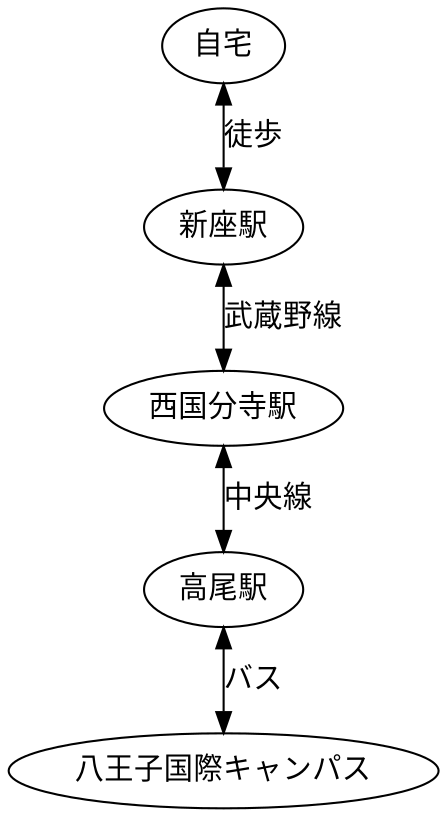

# 廣瀬昇太の通学経路

[メンバー表に戻る](member.md#メンバー表)

```graphviz
digraph {
    edge [dir=both]

    // 例
    自宅 -> 新座駅 [label=徒歩]
    新座駅 -> 西国分寺駅 [label=武蔵野線]
    西国分寺駅 -> 高尾駅 [label=中央線]
    高尾駅 -> 八王子国際キャンパス [label=バス]
}
```
